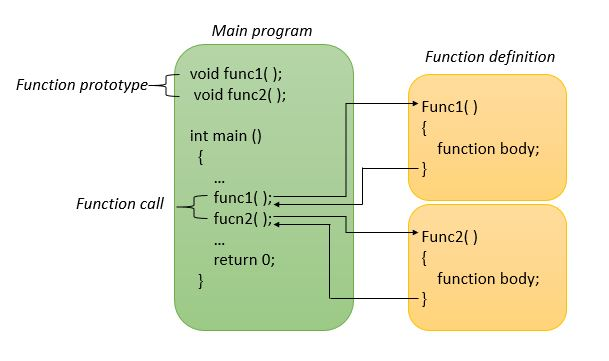
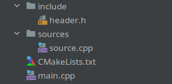
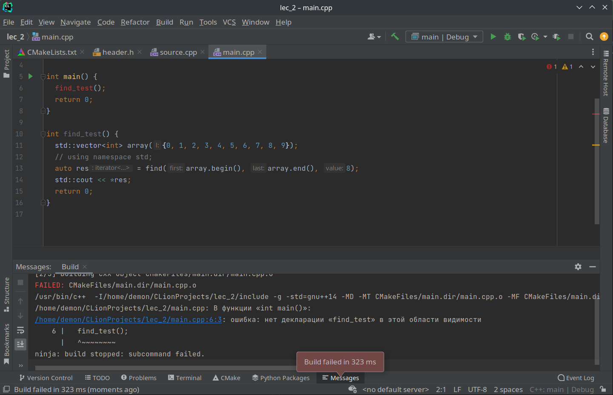
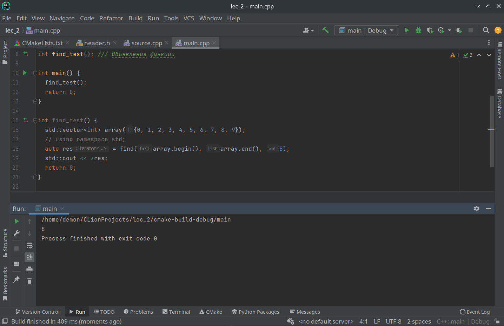
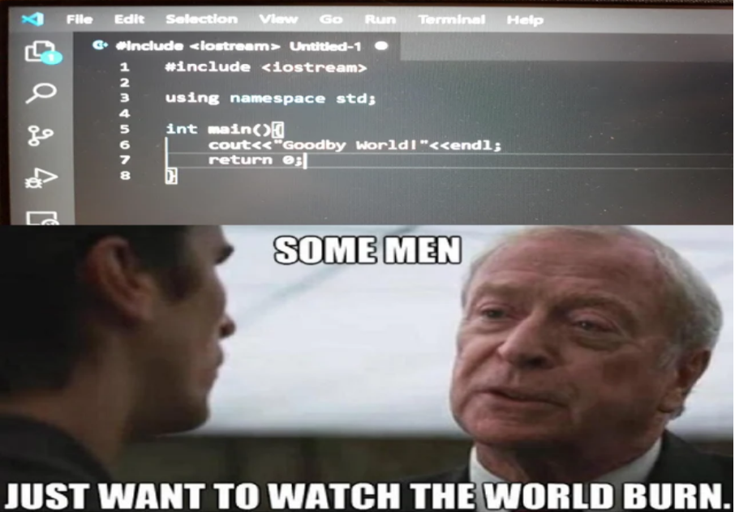

<style type="text/css">
  .reveal pre code {
    font-size: 1em;
    line-height: 1.2;
    height: 200%;
    max-height: 1000% !important;
  }
  .reveal section p {
    display: inline-block;
    font-size: 0.9em;
    line-height: 1em;
    vertical-align: top;
  }

  .reveal section li {
    font-size: 0.9em;
    line-height: 1em;
    vertical-align: top;
  }

  .reveal section table {
    display: inline-block;
    font-size: 0.7em;
    line-height: 1.2em;
    vertical-align: top;
  }

</style>
[comment]: <> (highlightTheme: "darkula")
[//]: <> (highlightTheme: "darkula")

#### Сибирь I
## Функции

--

### Задача минимум


--

### Задача максимум
Модифицировать программу с прошлой лекции

---

## Теория

--

## Функции
_Это атомы, из которых состоит тело программы_

--

#### Строение функции

```cpp
int function_name(int arg1, const int arg2) {     // заголовок
  ...                           // тело функции
  ...
  return result;                // возврат значения
}                               // конец определения функции

const std::string num_in_text(double arg);
```

--

#### Принцип действия


--

#### Процедура -- функция, которая ничего не возвращает
```cpp
void function_name(int arg, std::string& result) {
  ...                           
  ...
  return; // можно не писать
}                
```

--

#### Область видимости переменной
Это часть программы, в которой переменную можно использовать и изменять

--

```cpp
// Что выведет программа?

void function() {
  size_t i = 5;
  std::cout << i << std::endl;
  for (size_t j = 0; j < 3; ++j) {
    size_t i = 2;
    std::cout << i << std::endl;
  }
  if (i > 0) {
    int x = 10;
  }
  x = 5;
  std::cout << x << std::endl;
}
```

---

## Ссылки
СИбирь moment

--

#### Ссылка создает альтернативное имя для переменной

```cpp
int maine_coon = 10;
int& cat = maine_coon;  // cat является ссылкой (тип - int&)

maine_coon++;
// cat == maine_coon == 11

std::cout << "cat = " << &cat << ", m_c = " << &maine_coon << std::endl;
// cat и maine_coon взаимозаменяемы, ссылаются на 
// одно и то же значение и адрес в памяти
```

--

>Объявление -- указывает уникальное имя сущности, её тип и другие характеристики

>Определение -- предоставляет компилятору сведения для создания машинного кода

--

```cpp
int find_test();  // Объявление функции, чтобы main увидела её

int main() {
  ...
  return 0;
}

int find_test() { // Определение функции
  ...
}
```

--

#### Передача аргументов по ссылкам

```cpp
// Создает копию переменной time с именем input внутри функции
void func1(std::string input) {...} 

// Делает input псевдонимом time
void func2(std::string& input) {...}

// Делает input псевдонимом time, input нельзя изменить
void func3(const std::string& input) {...}

void smth() {
  std::string time = "60";
  func1(time);
  func2(time);
  func3(time);
  ...
}
```

--

### Важно
Здесь мы имеем дело с lvalue-ссылками, которые указывают на изменяемые объекты

---

### Составление программы из нескольких модулей

--

### Пример:


--

```cpp
// main.cpp
#include <iostream>
#include "header.h"

int find_test();  // Объявление функции, чтобы main увидела её

int main() {
  function();
  return 0;
}

int find_test() { // Определение функции
  std::vector<int> array({0, 1, 2, 3, 4, 5, 6, 7, 8, 9});
  auto res = find(array.begin(), array.end(), 8);
  std::cout << *res;
  return 0;
}
```

--



--



--

```cpp
/// source.cpp
#include <iostream>
#include "header.h"

/// Ya
size_t results_number_1(const std::string& search) {
  std::vector<std::string> data(20, search);
  return data.size();
}

/// Go
size_t results_number_2(const std::string& search) {
  std::vector<std::string> data(15, search);
  return data.size();
}

/// Область видимости
void function() {
  size_t i = 5;
  std::cout << i << std::endl;
}
```

--

### Директива `#include`
Эта директива заставляет препроцессор добавить содержимое файла в программу

--

### Примеры

```cpp
#include <iostream>    // добавляет заголовочный файл iostream
#include "header.h"    // добавляет пользовательский заголовочный файл
```

--

```cpp
// header.h

#ifndef PW_HEADER_HEADER_H_
#define PW_HEADER_HEADER_H_

#include <string>

size_t results_number_1(const std::string&);
size_t results_number_2(const std::string&);

void function();

#endif //PW_HEADER_HEADER_H_
```

--

```
# CmakeLists.txt

cmake_minimum_required(VERSION 3.24)
project(lec_2)

set(CMAKE_CXX_STANDARD 14)

add_library(${PROJECT_NAME} STATIC
        ${CMAKE_CURRENT_SOURCE_DIR}/sources/source.cpp
        )

add_executable(main
        ${CMAKE_CURRENT_SOURCE_DIR}/main.cpp
        )

target_include_directories(${PROJECT_NAME} PUBLIC
        "$<BUILD_INTERFACE:${CMAKE_CURRENT_SOURCE_DIR}/include>"
        "$<INSTALL_INTERFACE:include>"
        )

target_link_libraries(main ${PROJECT_NAME})
```

---

### Пространство имен 
Поддержка пространства имен — средство, предназначенное для упрощения разработки крупных программ, комбинирующих код от нескольких поставщиков.

--

```cpp
// header.h

namespace Yandex {
  size_t results_number(const std::string&);
}

namespace Google {
  size_t results_number(const std::string&);
}
```

--

```cpp
// main.cpp

int search_test() {
  std::string input = "result";
  std::cout << "Google results num: " << Google::results_number(input) << std::endl;
  std::cout << "Yandex results num: " << Yandex::results_number(input) << std::endl;
  return 0;
}
```

--

### Так почему же `using namespace std` -- плохо?
> Предпочтительно делать так, чтобы доступ к пространству имён `std` был предоставлен только тем функциям, которым он необходим.

--

### Директива `using`

```cpp
using std::cout; // Позволяет использовать cout
using std::endl; // Позволяет использовать endl

using namespace std;    // Ленивый подход - некрасиво
```

--


