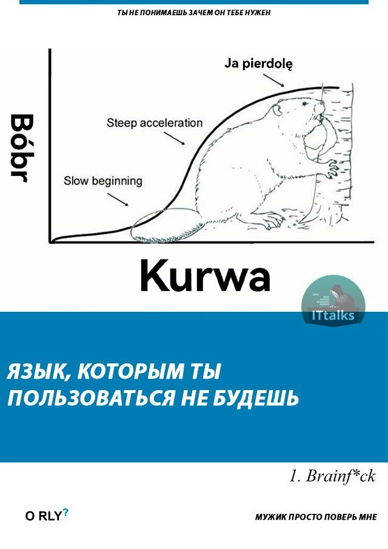
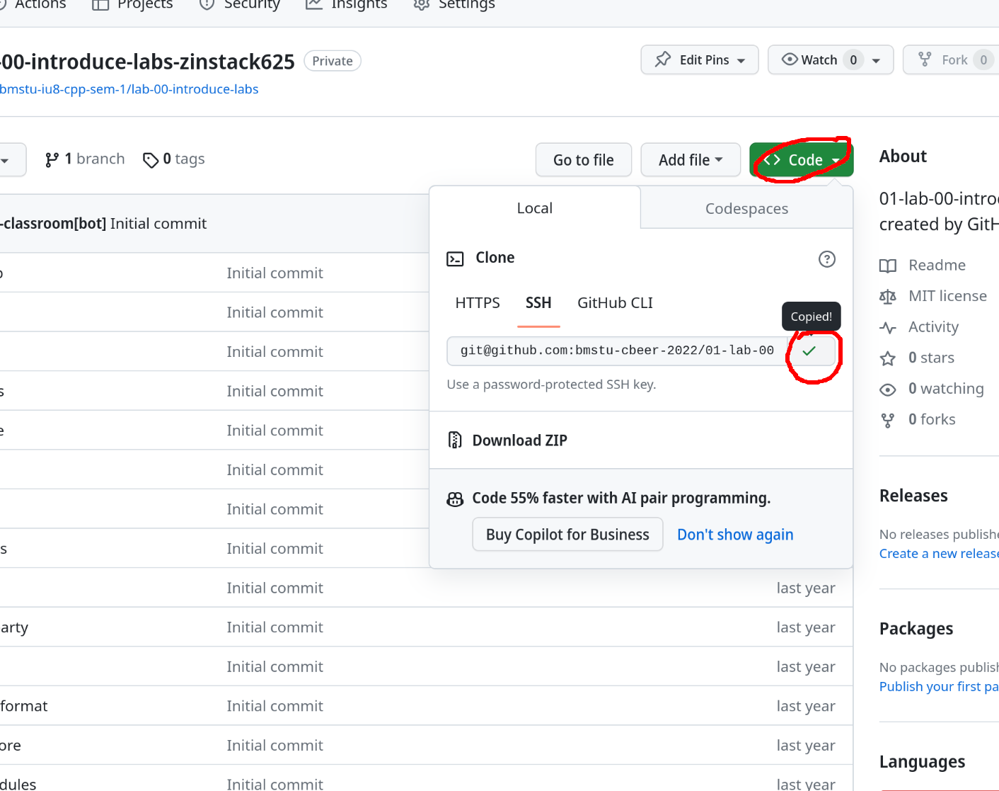
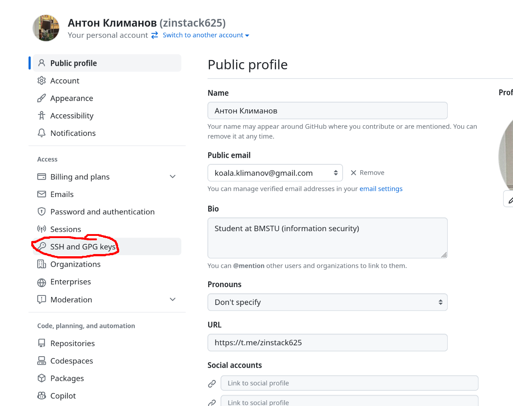
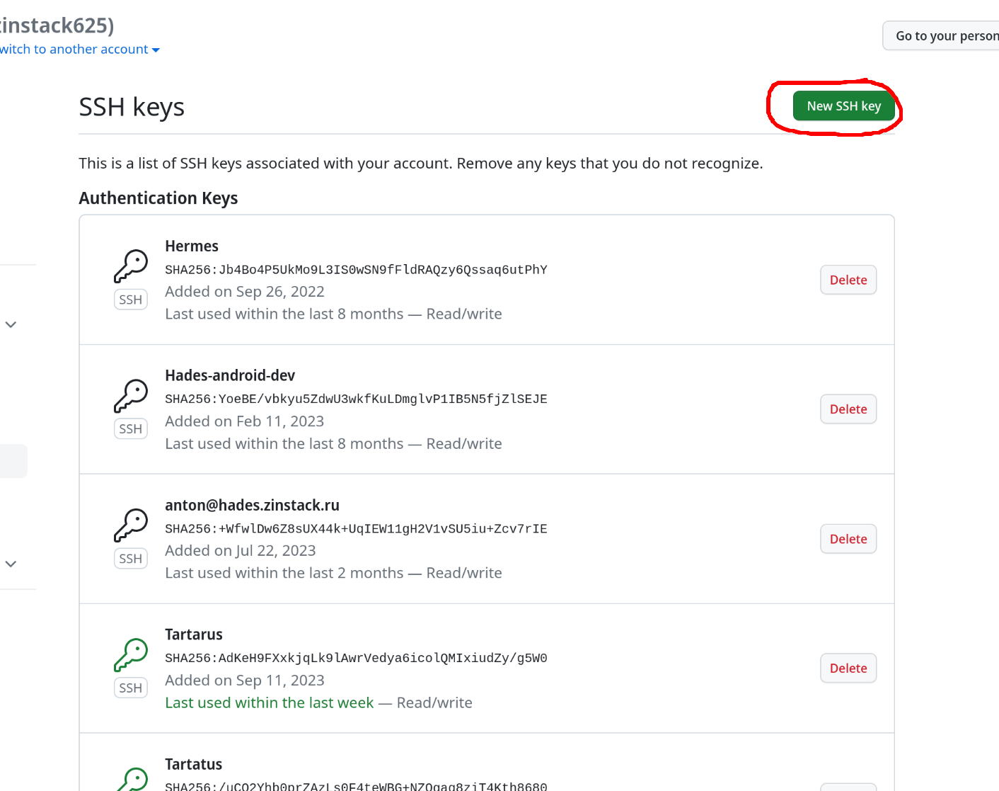
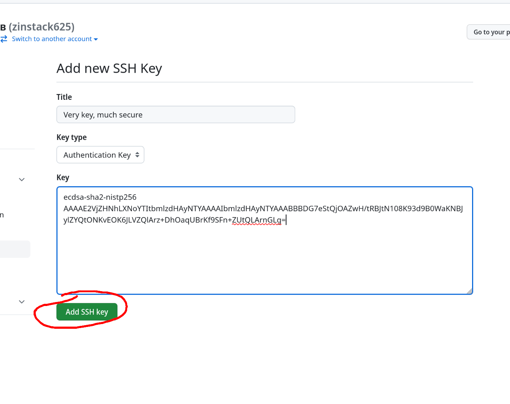
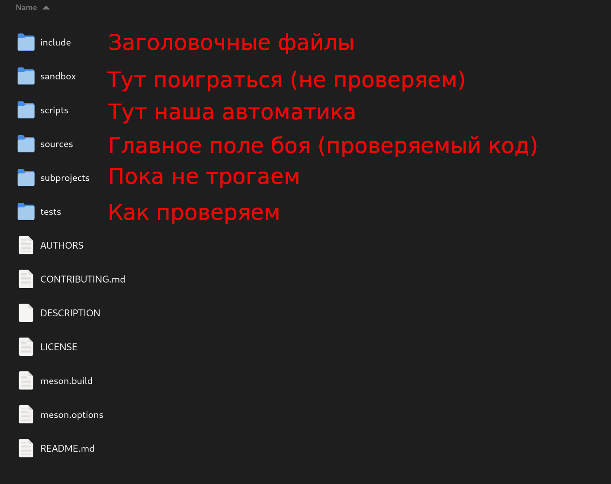

# Сибирь I
Как начать свой путь в программировании

---

## Мотивирующая прелюдия

А собственно зачем нам C++??

----



----

## А если серьёзно

- C++ - лучший язык для начала программирования
- C++ активно используется в громаде современных проектов
- C++ можно запустить везде
- C++ может всё

----

### Почему лучший?

В C++ представлены (почти) все используемые концепты программирования:
- Функциональное программирование
- Структурное программирование
- Объектно-ориентированное программирование
- Многопоточность
- Ручное управление памятью

----

### Где используется?
- Android (NDK) и iOS
- Игрушки различные
- QT
- Python (внезапно)
- Операционные системы
- Прошивки и прочее низкоуровневое

----

#### Где можно запустить?
- *NIX и подобные
- Windows
- Прочие не *NIX-подобные
- Отсутствие операционной системы
- Распределённые ужасы

----

### А что может?
- C++ - низкоуровневый ЯП (можно цепляться к железу)
- C++ имеет интерфейсы к операционной системе
- C++ имеет самый большой набор библиотек, в том числе C

----

### C++ - это круто, даже если вы его не используете

---

#### Наши инструменты

- GitHub
- VSCode
- Google

---

# GitHub
И как с ним бороться

----

### Как это работает


----

### Как скачать репозиторий

```
Команда для клонирования в терминале:
git clone <ссылка на репозиторий>
```

----

#### Находим репозиторий на Git


----


----

#### Копируем ссылку


----

#### Открываем Терминал (Windows)


----


----

#### Генерируем ключ

```bash
ssh-keygen
```

И запоминаем следующее:

```bash
cat ~/.ssh/id_rsa.pub
```

----

#### User settings


----

#### Копаемся в настройках



----



----



----

#### Клонируем репозиторий
Используем git clone <ссылка>

```bash
anton@tartarus:~/Code/ISCRA/CBeer> git clone git@github.com:bmstu-cbeer-2023/01-lab-00-introduction-CoolUser.git
Cloning into '01-lab-00-introduction-CoolUser'...
remote: Enumerating objects: 181, done.
remote: Counting objects: 100% (181/181), done.
remote: Compressing objects: 100% (155/155), done.
remote: Total 181 (delta 30), reused 166 (delta 21), pack-reused 0
Receiving objects: 100% (181/181), 33.53 MiB | 784.00 KiB/s, done.
Resolving deltas: 100% (30/30), done.
```

----

### Магия


---

## Теперь можно писать код

----

# VSCode
## Или другой IDE/текстовый редактор

Орудие, несущее свет

----

### Интересные плагины, с которыми хочется жить

- Meson (от mesonbuild)
- CodeLLDB (от vadimcn)
- WSL (для Windows)

----

### Открываем, доверяем, пишем код

----

### Устройство лабораторной



----

### Написали код в новом файле?

- `sources/` - внесите его в `sources/meson.build`
- `headers/` - ничего делать не надо

----

### Как устроена типичная программа

```cpp
#include <библиотека>

int main() {
  // здесь пишем код
  return 0;       // Возвращаемое значение
}
```

----

#### Первые команды

```cpp
std::cout << "Текст"        - вывод текста на экран
std::cout << "Welcome to the club, partner";
std::endl;                   - переход на следующую строку
std::cout << "Some text" << std::endl;
```

----

### Самое время показать свое детище миру

---

## Загрузка на GitHub
или как не испортить `master`

----

### Предварительная настройка

```bash
git config --global user.name "Your Name"
git config --global user.email "your@email.tld"
```
Иначе будет ругаться на `git commit`

----

### Вот они слева направо

```bash
cd ./dir_name                             - переход в директорию
git branch <название ветки>               - создать новую ветку
git switch <название ветки>               - переход на другую ветку

git add <имя файла>                       - добавление файла в коммит
git commit -m "<Комментарий>"             - подготовка коммита
git push origin <название ветки>          - отправляем на гит
```

----

#### Это не взлом Пентагона

```bash
anton@tartarus:~/Code/ISCRA/CBeer/examble-repo> git branch wp/lab
anton@tartarus:~/Code/ISCRA/CBeer/examble-repo> git switch wp/lab
Switched to branch 'wp/lab'
anton@tartarus:~/Code/ISCRA/CBeer/examble-repo> git add new-file
anton@tartarus:~/Code/ISCRA/CBeer/examble-repo> git commit -m 'lab done'
[wp/lab 6c479e6] lab done
 1 file changed, 0 insertions(+), 0 deletions(-)
 create mode 100644 new-file
anton@tartarus:~/Code/ISCRA/CBeer/examble-repo> git push origin wp/lab
```
----

### Еще немного...


----

### Создаем Pull request


----

### Отправили на проверку

`/check_me https://github.com/bmstu-cbeer-2023/01-lab-00-introduction-CoolUser/pulls/1`

---

### У меня что-то не работает, что делать?

Спросить. Мы отвечаем на вопросы. Честно!


---

> У программиста нет push в master, только pull request - Дмитрий Михайлович Степанов
