# Сибирь I
Как начать свой путь в программировании

--

## Мотивирующая прелюдия
А собственно зачем нам C++??

--


--

## А если серьёзно
- C++ -- лучший язык для начала программирования
- C++ активно используется в громаде современных проектов
- C++ можно запустить везде
- C++ может всё

--

### Почему лучший?
В C++ представлены (почти) все используемые концепты программирования:
- Функциональное программирование
- Структурное программирование
- Объектно-ориентированное программирование
- Многопоточность
- Ручное управление памятью

--

### Где используется?
- Android (NDK) и iOS
- Игрушки различные
- QT
- Python (внезапно)
- Операционные системы
- Прошивки и прочее низкоуровневое

--

#### Где можно запустить?
- *NIX и подобные
- Windows
- Прочие не *NIX-подобные
- Отсутствие операционной системы
- Распределённые ужасы

--

### А что может?
- C++ - низкоуровневый ЯП (можно цепляться к железу)
- C++ имеет интерфейсы к операционной системе
- C++ имеет самый большой набор библиотек, в том числе C

--

### C++ - это круто, даже если вы его не используете

---

### Наши инструменты

- GitHub
- VSCode
- Google

Приступим к установке

--

##### Если вы average windows ~~slave~~ fan
Проще будет поставить Linux (<3)

--

### Превращаем винду в Linux

--

#### 1. Устанавливаем пакетный менеджер chocolatey

--

##### Win + R -- открывается окошко запуска программ

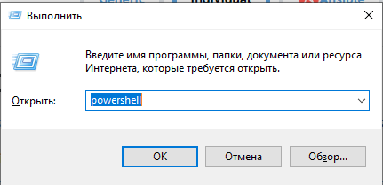

Запускаем программу от имени администратора через Ctrl + Shift + Enter

--

##### Вводим следующие команды (можете загуглить установку chocolatey)

```powershell
Get-ExecutionPolicy

# Если возвращается Restricted, то колдуем 
Set-ExecutionPolicy Bypass -Scope Process

# Устанавливаем (это все одна строчка)
Set-ExecutionPolicy Bypass -Scope Process -Force;
 [System.Net.ServicePointManager]::SecurityProtocol = 
 [System.Net.ServicePointManager]::SecurityProtocol -bor 3072;
 iex ((New-Object System.Net.WebClient).DownloadString
 ('https://community.chocolatey.org/install.ps1'))
```

--

### Как примерно выглядит
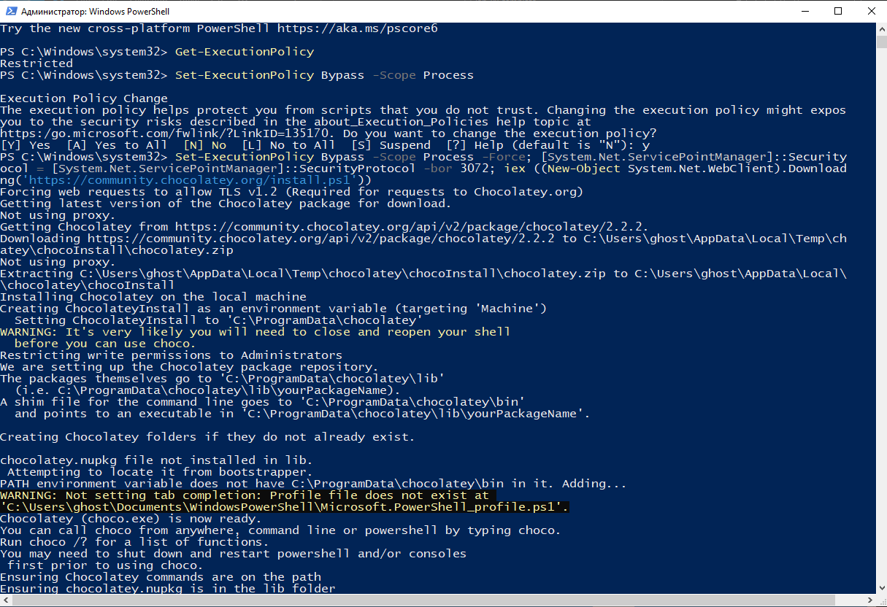

--

##### 2. Через choco устанавливаем систему сборки meson (устанавливаем всегда из под администратора)
```powershell
choco install meson
```

--

### Как примерно выглядит
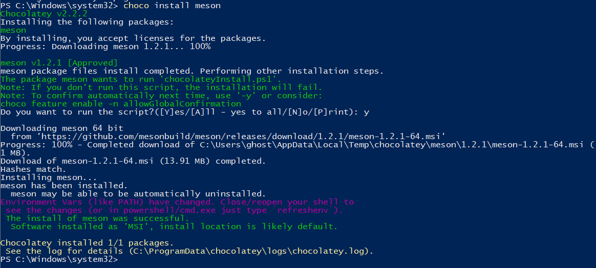

--

### 3. Через choco устанавливаем Git
```powershell
choco install git
```

--

### 4. Устанавливаем MSYS2 (из интернета)

--

### 5. Настраиваем MSYS2 так, чтобы оно запустилось

1. Жмякаем Win + R
2. Вводим sysdm.cpl + enter
3. Открываем переменные среды

--

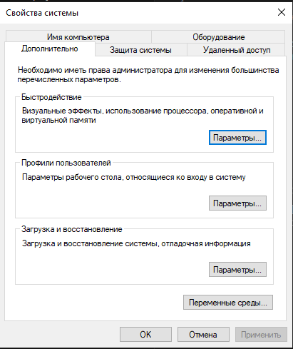

--

#### Залезаем в системные переменные PATH
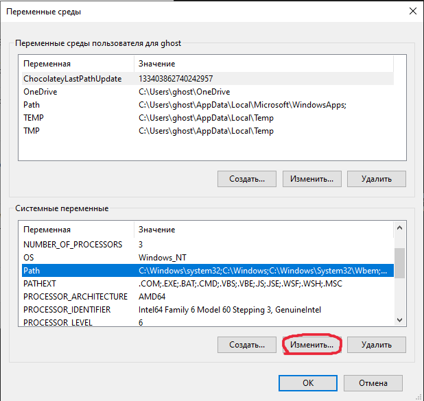

--

#### Создаем и вводим <адрес установки msys2>\usr\bin

--

у меня в примере Msys2 установлен в C:\soft\msys64

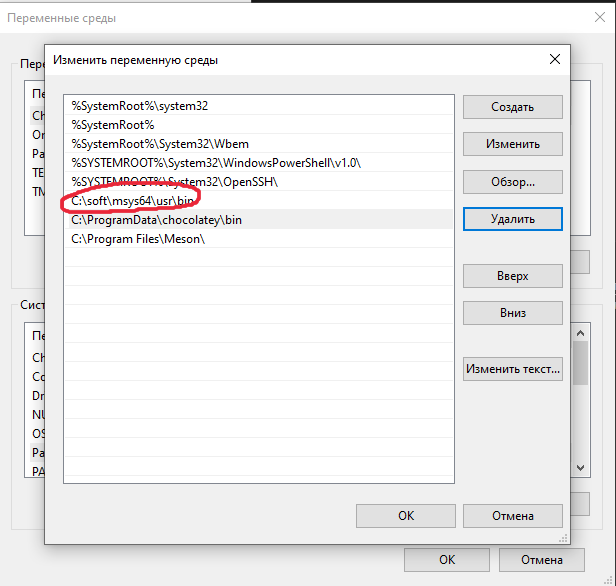

--

### 6. Ставим VSCode (как угодно)

---

### Если вы average Linux enjoyer
Снимаем шляпу

--

##### Нужно поставить только meson и vscode (обязательно сборку от microsoft)
Делается это в одну строчку (пример для ubuntu)

```bash
sudo apt install meson
```

--

# GitHub
И как с ним бороться

--

### Как это концептуально работает


--

#### С Git мы работаем через терминал
Для Windows -- cmd или powershell

--

### Генерируем ключ

```bash
ssh-keygen
```

И запоминаем содержание сгенерированного файла (в терминале можно с помощью команды `cat`):

```bash
cat ~/.ssh/id_rsa.pub
```

--

#### User settings


--

#### Копаемся в настройках


--


--

### Вставляем свой ключик


--

#### Находим свой репозиторий на Git


--


--

#### Копируем ссылку


--

#### Открываем терминал и переходим в папку, в которую хотим склонировать репозиторий

```bash
# Пример команды перехода в папку в терминале
cd /home/projects
```

--

#### Клонируем репозиторий
```bash
# Данной командой
git clone <ссылка>
```

```bash
# Пример
anton@tartarus:~/Code/ISCRA/CBeer> git clone git@github.com:
bmstu-cbeer-2023/01-lab-00-introduction-CoolUser.git
Cloning into '01-lab-00-introduction-CoolUser'...
remote: Enumerating objects: 181, done.
remote: Counting objects: 100% (181/181), done.
remote: Compressing objects: 100% (155/155), done.
remote: Total 181 (delta 30), 
reused 166 (delta 21), pack-reused 0
Receiving objects: 100% (181/181), 33.53 MiB |
 784.00 KiB/s, done.
Resolving deltas: 100% (30/30), done.
```

--

### Магия


--

## Теперь можно писать код

---

## VSCode
#### (или другой IDE/текстовый редактор)

Орудие, несущее свет

--

### Интересные плагины, с которыми хочется жить

- Meson (от mesonbuild)
- CodeLLDB (от vadimcn)
- WSL (для Windows)

--

#### Ставим необходимые плагины
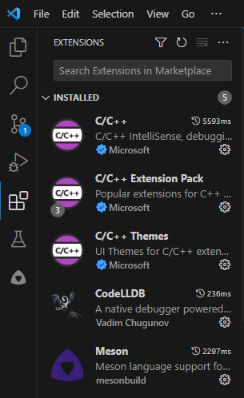

--

##### Открываем папку с репозиторием
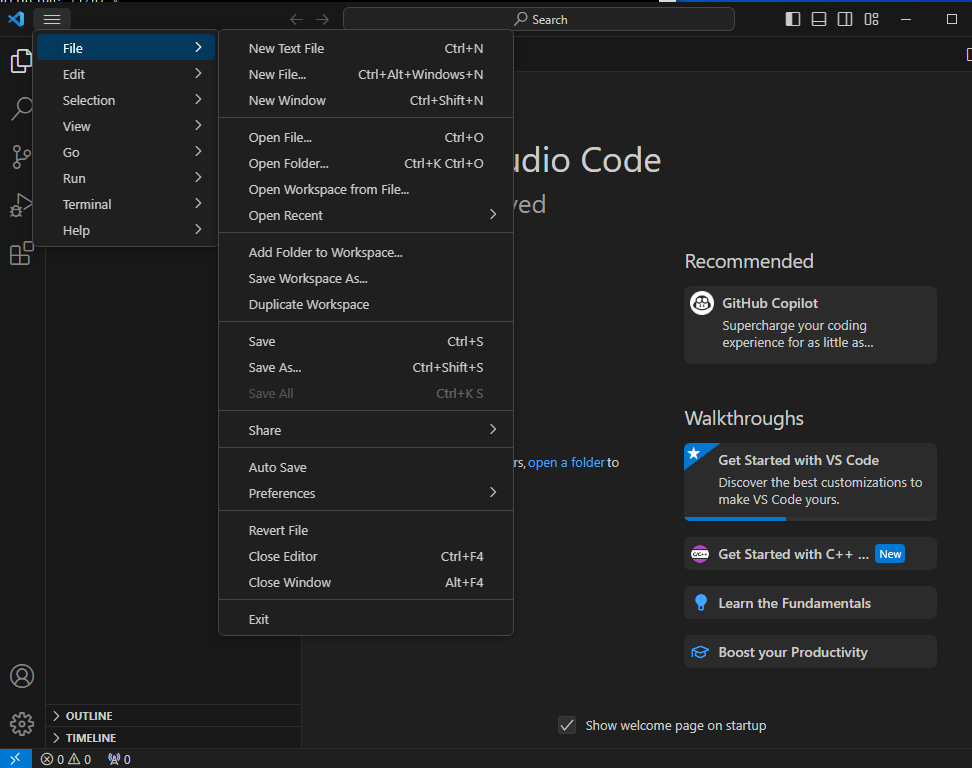

--

##### Доверяем
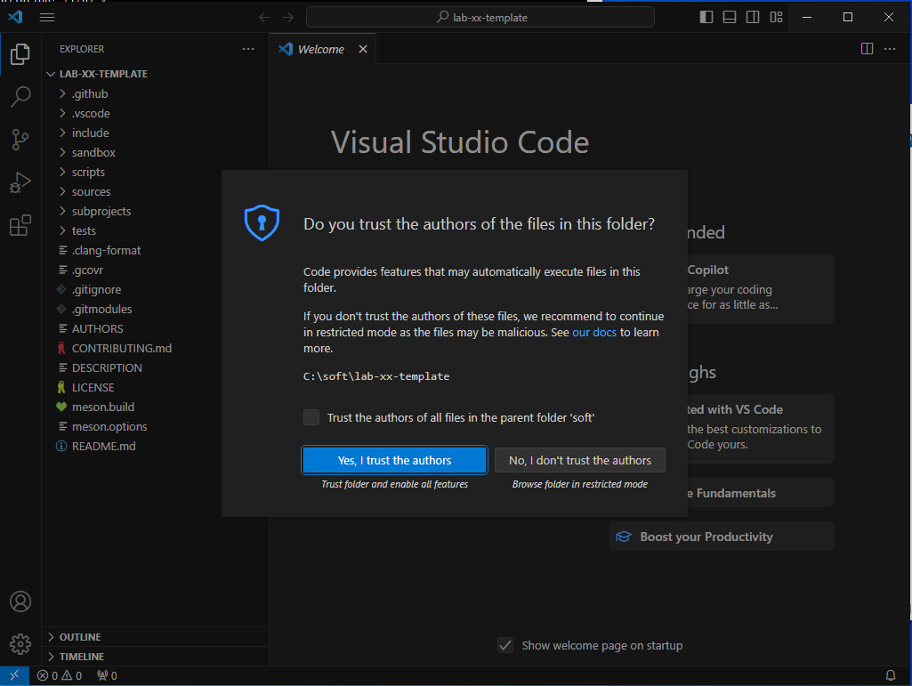

--

#### Запускаем конфигурацию проекта, если само не сработало
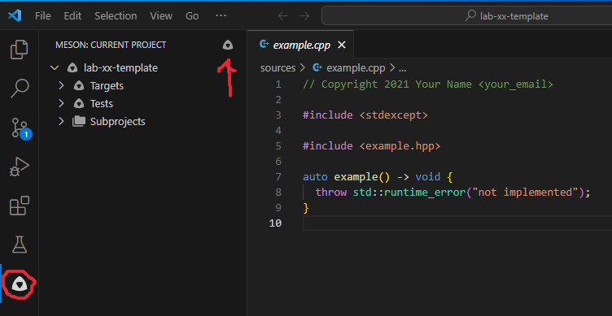

--

### Устройство лабораторной


--

### Написали код в новом файле?
- `sources/` - внесите его в `sources/meson.build`
- `headers/` - ничего делать не надо

--

### Как устроена типичная программа

```cpp
#include <библиотека>

int main() {
  // здесь пишем код
  return 0;       // Возвращаемое значение
}
```

--

#### Первые команды

```cpp
std::cout << "Текст";      //вывод текста на экран
std::cout << "Welcome to the club, partner";
std::cout << std::endl;    // переход на следующую строку
std::cout << "Some text" << std::endl;
```

--

#### Запускаем код и смотрим, что получилось
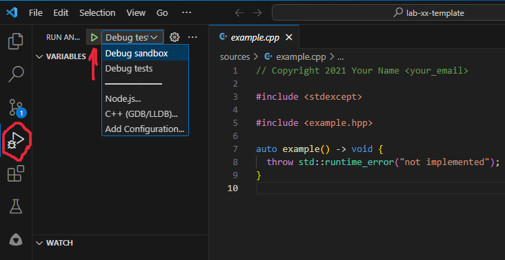

--

### Самое время показать свое детище миру

---

## Загрузка на GitHub
или как не испортить ветку `master`

--

### Предварительная настройка

```bash
git config --global user.name "Your Name"
git config --global user.email "your@email.tld"
```

#### Иначе `git` будет ругаться на `git commit`

--

### Вот они слева направо

```bash
# переход в директорию
cd ./dir_name
# создать новую ветку (предпочтительно wp/lab)
git branch <название ветки>
# переход на другую ветку (только что созданную)
git switch <название ветки>
# выводит изменения в репозитории
git status
# добавление файла в коммит
git add <имя файла>
# подготовка коммита
git commit -m "<Комментарий>"
# отправляем на git
git push origin <название ветки>
```

--

#### Это не взлом Пентагона

```bash
anton@tartarus:~/CBeer/examble-repo> git branch wp/lab
anton@tartarus:~/CBeer/examble-repo> git switch wp/lab
Switched to branch 'wp/lab'
anton@tartarus:~/CBeer/examble-repo> git add new-file
anton@tartarus:~/CBeer/examble-repo> git commit -m 'lab done'
[wp/lab 6c479e6] lab done
 1 file changed, 0 insertions(+), 0 deletions(-)
 create mode 100644 new-file
anton@tartarus:~/CBeer/examble-repo> git push origin wp/lab
```

--

### Еще немного...


--

### Создаем Pull request


--

#### Отправляем на проверку боту в любой точке mattermost

`/check_me https://github.com/bmstu-cbeer-2023/01-lab-00-introduction-CoolUser/pulls/1`

--

### "У меня что-то не работает, что делать?"

Спросить. Мы отвечаем на вопросы. Честно!


--

#### Затруднения на данном этапе -- совершенно нормально, так что лучше не биться головой об стенку слишком долго, а разбиться, но чуть-чуть, и посоветоваться с обществом на курсе, наверняка подобные проблемы уже встречались :)

---

> У программиста нет `push` в `master`, только `pull request`  
(c) Dema
