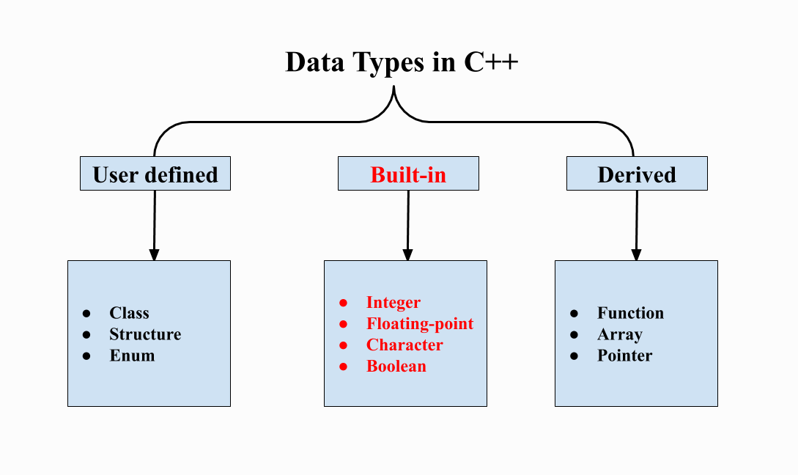
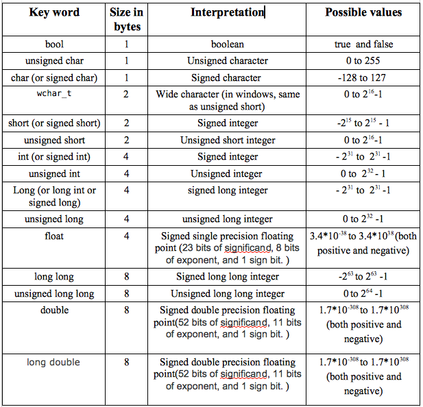
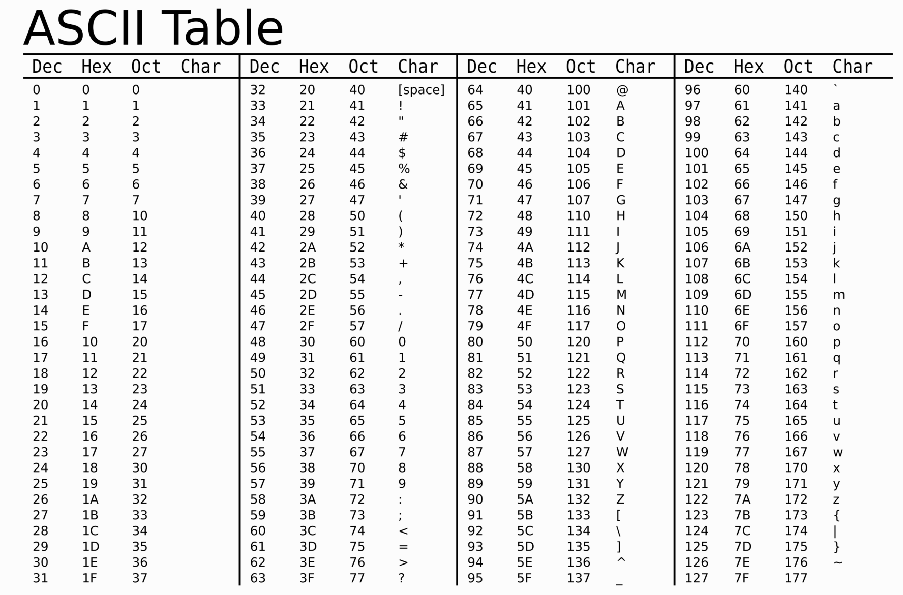

<style type="text/css">
  .reveal pre code {
    font-size: 1em;
    line-height: 1.2;
    height: 200%;
    max-height: 1000% !important;
  }
  .reveal section p {
    display: inline-block;
    font-size: 0.9em;
    line-height: 1em;
    vertical-align: top;
  }

  .reveal section li {
    font-size: 0.9em;
    line-height: 1em;
    vertical-align: top;
  }

  .reveal section table {
    display: inline-block;
    font-size: 0.7em;
    line-height: 1.2em;
    vertical-align: top;
  }

</style>


#### Сибирь I
## Типы, условия, циклы

--

## Задача
Написать программу, проверяющую защищенность пароля

--

### Каким требованиям должна соответствовать программа?

--

### Обязательно:
- Принимать данные на вход
- Проверять символы введенного пароля
- Выводить ответ в зависимости от входных данных

---

#### Рубрика
### Документация за 15 минут (40)

---

### std::cin

```cpp
std::cin >> <имя переменной>;    // ввод с клавиатуры   

int x, y;
std::cin >> x >> y;

/* Это комментарий */
// Это - тоже
/// Видимый комментарий
```

---

## Переменные
Переменная -- это именованная область памяти

--

#### Типы данных


--

#### Встроенные типы данных


--

### ASCII (char == int?)


--

#### Любую переменную встроенного типа данных _нужно инициализировать_, чтобы в ней не хранился мусор

--

#### Предпочтительнее использовать:
- `int`
- `size_t (unsigned long)`
- `double`
- `char`
- `bool`

--

#### Несколько примеров
```cpp
int a = 0;
a += 3;     // эквивалентно a = a + 3; 

// так же действуют операции -= *= /= %=

a /= 2;   // (a == 1) целочисленное деление

int b = sizeof(a); // (b == 4), sizeof возвращает размер типа

a %= b   // остаток от деления
```

---

### Массивы
Массив — это область памяти, где могут последовательно храниться несколько значений _одного типа_.

--

#### Примеры

```cpp
int numbers[4];
int numbers[4] = {1,2,3,4};
int numbers[4] = {1,2,3,4,5,6,7};        // ошибка
int numbers[] = {1,2,3,4,5,6};

char arr[] = {'u', 'w', 'u'}
char hello[] = "world";
```

--

### Этого делать мы, конечно же, не будем

--

## std::vector
Массив, опередивший свой размер

--

### Примеры
```cpp
#include <iostream>
#include <vector>
...
std::vector<int> vec0 = {1, 2, 3};
vec0.push_back(4);      //  добавляем элемент в конец вектора
vec0.resize(8);    // Изменяем размер вектора

std::vector<char> vec({'u', 'w', 'u'});
size_t vec_size = vec.size();
std::cout << vec[0] << vec[1] << vec[2];

```

--

### std::string
Строка сына маминой подруги

--

### Примеры
```cpp
#include <iostream>
#include <string>
...
std::string str_a("Hello");
std::string str_b = "world";
std::string big_str = str_a + str_a[4] + ',';
big_str += str_b;

std::cout << big_str << " size = " << big_str.size();

```


---

### Условия
```cpp
...

if (condition) {
  ... // код при condition == true
} else {
  ... // код при condition == false
}

... //дальнейшее выполнение программы
``` 

--

### Логические выражения
```
cond_a && cond_b // конъюнкция
cond_a || cond_b // дизъюнкция
cond_a == cond_b // эквивалентность
cond_a != cond_b // не равно
!cond_a // отрицание
>   >=    <    <= // математика
```

---

## Циклы
> Цикл -- это повторение одного и того же действия раз за разом в надежде на конечность цикла

--

## while () {}
```cpp
while (condition) {
  ...
  if (flag) {
    break; // позволяет выйти из цикла досрочно
  }
  ...
}
... // Начинается, как только condition == true
```

--

## for () {}
```cpp
...

for (size_t i = 0; i < n; ++i) {
  ... // тело цикла
}

...

for (;;) {
  ... // выхода нет
}
```

---

#### LET'S PARTY

